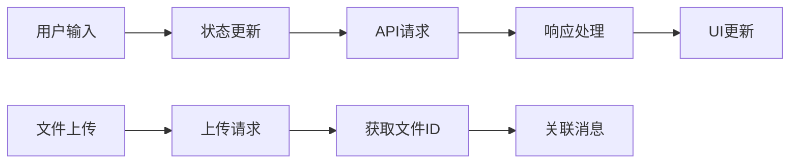

# LLM2.0 聊天应用项目详细说明

## 一、项目架构详解

### 1. 核心技术栈
本项目采用现代化的前端技术栈，主要包括：
- React 18：提供强大的组件化开发能力
- Remix + Vite：实现高效的应用构建和路由管理
- TailwindCSS：灵活的原子化CSS解决方案
- Zustand：轻量级状态管理库
- Radix UI：高可访问性的UI组件库

### 2. 项目结构分析
```
/app
├── apis/          # API接口封装
├── components/    # 组件目录
│   ├── chat/     # 聊天相关组件
│   ├── markdown/ # Markdown渲染
│   ├── setting/  # 设置组件
│   └── ui/       # 通用UI组件
├── store/        # 状态管理
└── utils/        # 工具函数
```

## 二、核心功能实现

### 1. 聊天功能
核心聊天功能通过以下组件实现：

```typescript
// ChatInput.tsx - 消息输入组件
export default function ChatInput({ type }: ChatContentType) {
  const [prompt, setPrompt] = useState("");
  const [isLoading, setIsLoading] = useState(false);
  const [files, setFiles] = useState<FileInfoInter[]>([]);
  // ... 其他状态管理
}
```

### 2. 状态管理
使用Zustand进行状态管理：
```typescript
interface ChatState {
  messages: MessageInter[];          // 消息列表
  messages_inline: MessageInter[];    // 内联消息列表
  sendMessageFlag: string;           // 消息发送标志
  sendMessageFlagInline: string;     // 内联消息发送标志
}
```

### 3. API集成
项目集成了Coze API，主要包括：
```typescript
// 聊天接口
asyncChat(messages: MessageApiInter[], abort: AbortController)

// 文件上传
asyncFileUpload(file: File)

// 消息轮询
asyncRetrievePolling(conversation_id: string, chat_id: string)
```

## 三、数据流动图解



## 四、认证系统

### 1. 双重认证机制
项目支持两种认证方式：
1. Personal Access Token认证
2. OAuth PKCE认证

```typescript
// oauth.ts
export function getToken() {
  const auth_type = getStorageSetting()?.auth_type;
  return auth_type === "one"
    ? getStorageSetting()?.token
    : getStorageSetting()?.access_token;
}
```

## 五、组件交互

### 1. 聊天组件
- ChatContent：消息展示
- ChatInput：消息输入
- ChatSidebar：侧边栏管理
- ChatDialog：对话框

### 2. Markdown渲染
使用react-markdown实现Markdown渲染：
```typescript
const Markdown: FC<{ children: string }> = ({ children }) => {
  return (
    <ReactMarkdown
      remarkPlugins={[remarkMath, supersub, remarkBreaks, remarkGfm]}
      rehypePlugins={[rehypeHighlight]}
    >
      {children}
    </ReactMarkdown>
  );
};
```

## 六、性能优化

### 1. 消息处理优化
- 使用流式传输提高响应速度
- 实现消息分页加载
- 文件上传优化

### 2. 状态管理优化
- 使用Zustand进行高效状态管理
- 实现消息缓存机制

## 七、开发指南

### 1. 环境配置
```bash
# 安装依赖
pnpm install

# 开发环境运行
pnpm run dev

# 生产环境构建
pnpm run build
```

### 2. 关键配置
需要配置的环境变量：
- PERSONAL_ACCESS_TOKEN：个人访问令牌
- BOT_ID：机器人ID
- CLIENT_ID：OAuth客户端ID

## 八、项目亮点

1. 现代化技术栈
   - React 18 + Remix
   - TailwindCSS样式解决方案
   - TypeScript类型支持

2. 优秀的用户体验
   - 流式数据传输
   - 实时消息更新
   - 文件上传预览
   - 主题切换支持

3. 完善的功能支持
   - 多种文件格式支持
   - Markdown渲染
   - 代码高亮
   - 双重认证机制

## 九、调试指南

### 1. 常见问题处理
```typescript
// Token过期处理
if (jsonData.code == 700012006 && getStorageSetting()?.auth_type === "two") {
  const tokenRes = await asyncRefreshToken();
  updateTwoToken(tokenData.access_token, tokenData.refresh_token);
}
```

### 2. 开发建议
- 使用TypeScript进行类型检查
- 遵循组件化开发原则
- 保持代码整洁和可维护性
- 编写完善的测试用例

## 十、未来展望

1. 功能增强
   - 支持更多文件类型
   - 群聊功能
   - 消息搜索

2. 性能优化
   - 消息缓存机制
   - 大文件上传优化
   - 渲染性能提升

3. 用户体验
   - 错误处理完善
   - 自定义选项增加
   - 移动端适配优化